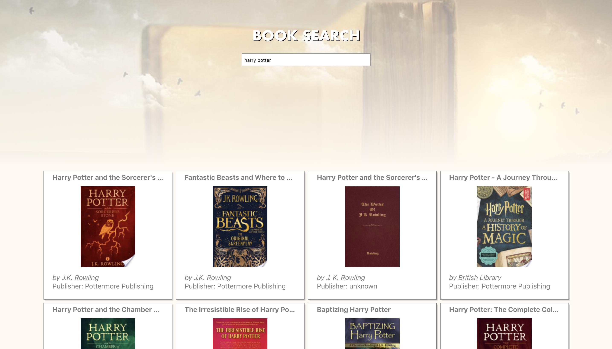
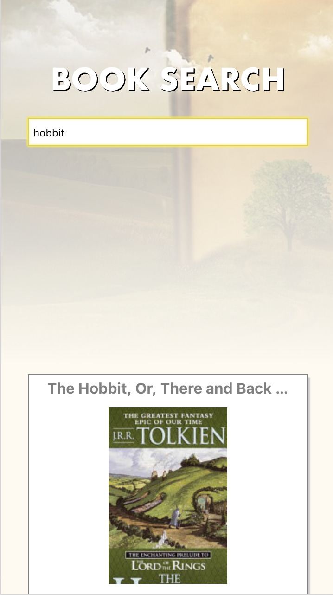
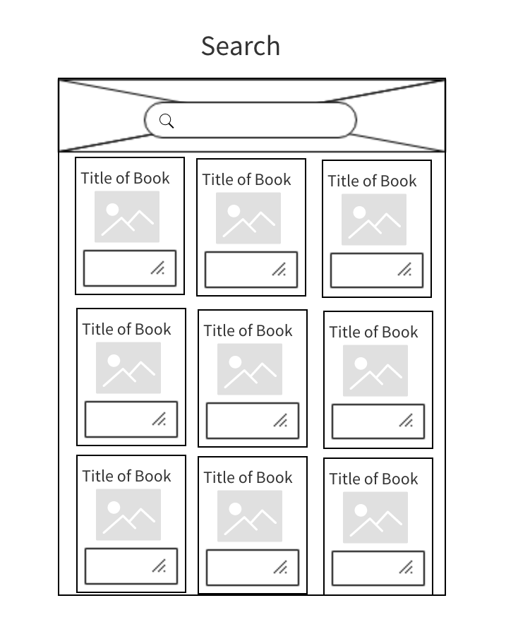
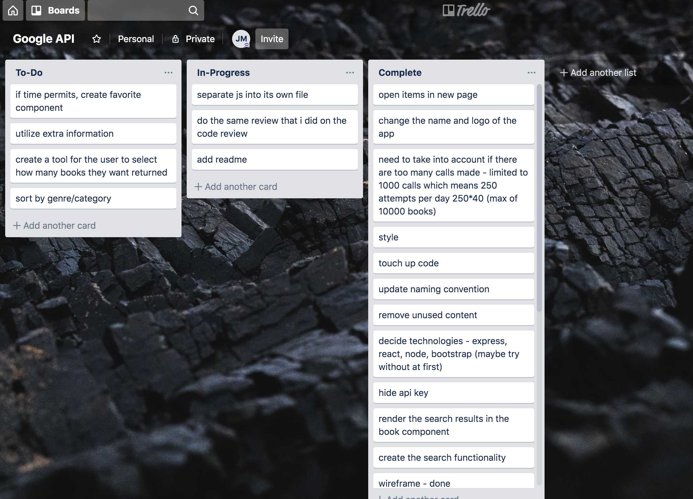
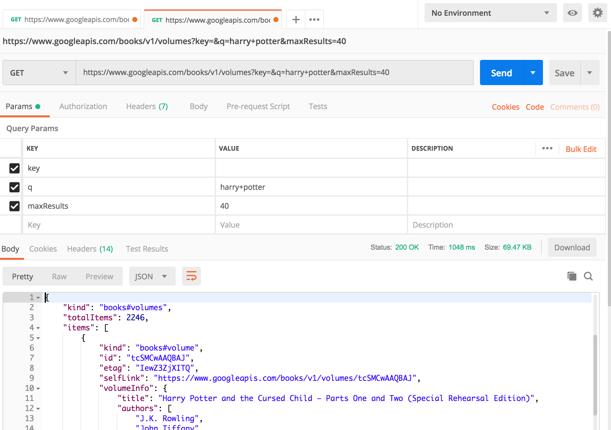

# [Google-Book-Search-API](https://google-book-search-api.herokuapp.com)

Find the books you've been looking for.  With the help of the Google Books API, search for some titles.




## Installing

* Fork this repository and clone into your local directory

```
git clone git@github.com:JustinPMitchell/google-books.git
```

* Navigate into google-books (or whatever you have renamed this directory)

```
cd google-books
```

* Set-up a node package and answer the package installation questions

```
npm init
```

* Install NPM dependencies

```
npm install --save
```

* Retrieve an API key from [Google Books API](https://developers.google.com/books/docs/v1/using#APIKey)

* Add a .env file with REACT_APP_GOOGLE_BOOKS_API = "my-api-key"

```
echo REACT_APP_GOOGLE_BOOKS_API = \"my-api-key\" > .env
```

* Start the program 

```
npm run start
```

* Test with Jest and ensure that all tests pass

```
npm test
```

## Technical Requirements

* Create an application that allows you to use the Google Books API to search for books, and deploy it somewhere that we can access through a web browser.

* This application should allow you to:
	* Type in a query and display a list of books matching that query.
	* Each item in the list should include the book's author, title, and publishing company, as well as a picture of the book.
	* From each list item, you should also be able to navigate to more information about the book, but this information does not necessarily need to appear on a page within your application. In other words, this could link out to an external site with more information about that particular book.

## Approach Taken

* Created a wireframe

* Created a Trello Board for tasks to complete

* Began with a react boilerplate
* Stubbed out coponents
* Used Postman to correctly find the correct way to query

* Created functions to create book components
* Updated functionality of api call to be searched as user typed
* Refined design
* Deployed to Heroku

## Built With

* [React](https://github.com/facebook/create-react-app) - Components, Links, .env REACT_APP variables
* [Node](https://nodejs.org/en) - react, reactdom
* [Google Books API](https://developers.google.com/books) - API to find books
* [Heroku](https://www.heroku.com) - deployment

## Unsolved Problems

* There is a limit on the amount of books called, because the google books api restricts the amount of books returned in each call and the amount of calls that can be made per day.
	* The list could have a feature that shows more if the user requests.

## Interesting Notes

* The search updates as the user types, but will wait for the user to stop typing
* The API is called recursively because of the restriction on the amount of books returned.  This may make it easier to implement a "show more" button in the future

## Next Steps

* Create a "show more" button for the users to see more books on the original querie
* Create a "favorite" button for the users to keep track of trending books
* Sort searches by category

## Authors

* **Justin Mitchell** - *API Management, UI Development, Fullstack Crafting* - [JustinPMitchell](https://github.com/JustinPMitchell)
* **Katrina Sabbak** - *Code Review*